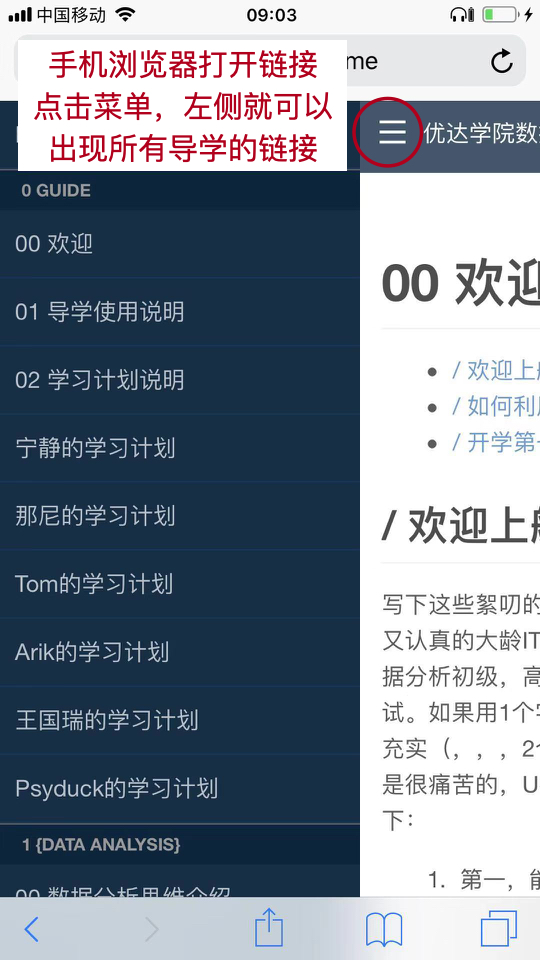

# 00 欢迎

[TOC]

## / 欢迎上船

写下这些絮叨的助教大大是一个（自认为）又帅又认真的大龄IT男，他用了8个月0基础完成了数据分析初级，高级，还参与了新Python课程的测试。如果用1个字对这段经历做总结，那就是：充实（，，，2个字了）。长话短说，自我突破是很痛苦的，Uda的这门课很好的特色小结如下：

1. 第一，能够用得到。要知道，学得再好，用不起来也白搭。数据分析的场景越来越多，数据集也非常多，还有各种竞赛，如果想用起来，大环境已经非常成熟了。而且在工作也确实有很多机会使用，比如之前自己用excel公式做了半自动化的报告就觉得很好了，学了课程才会了python这种更加风骚的操作。
2. 第二，学习曲线科学。不要会错意，对于初入门的小白来讲，课程还是挺难的。来听听想毕业都要会什么：Python语言、SQL语言、统计学、数据分析思维、A/B测试、Anaconda环境、Sublime IDE……。害不害怕？好了，不哭了……要知道Uda的学费没白交。Uda收了钱以后，还是做了很多努力平滑大家的学习曲线的：
3. 课程是项目制。4个项目就要交4个报告，还有非常专业（…严格的）评审老师。
4. 微信通关群。在学习的过程中，每个项目有通关群，群里有助教老师耐心的解决问题。
5. 论坛和1对1辅导。如果涉及代码比较复杂还可以发论坛（好多问题论坛里都有的……没忍住剧透了）。最后还有大招每周1次1对1电话辅导。
6. Uda在非常努力的提供反馈，甚至是不厌其烦的催促你在学，班主任小姐姐助教大大是非常认真的。
7. 第三，自我的突破。之前在知乎周刊看到一句话：。觉得会写代码又拽又神秘。也陆续买书瞎看，进展可以说…顶Uda一周的学习内容吧。在这次学习期间，不但一下入门了Python，R，JavaScript（用于数据分析的差不多了，目标明确，我是要用代码来分析数据的！）还学会了怎么应对统计分析、数据可视化、探索性数据分析、机器学习等等实际工作的实现。接下来就是自己积累了。

## / 如何利用SVIP资源

首先要说明的是，导学文件是课程的扩展解释，大家可以当成是公版的笔记，结合课程和导学内容，可以加快学习进度。如果有问题想讲得再详细点，可以和助教“点餐”，我随后会把内容增加到导学中，便于大家记录和日后复盘。

**知识学习首先是官方学习资源：**
- 全部内容在Uda网站完成（本地环境在项目完成后再研究配置）
- 项目也在Uda网站上完成，记得完成一点后点保存
- 项目完成后需要在最后部分提交
- 如果网站有奇怪的问题，请安装Chrome浏览器后再试

**接下来是导学内容作为参考和扩展：**
- 详见网页导航左边的列表（手机微信有限制，需要在手机浏览器打开）：

**当以上两部分还不能解决的时候：**
1. 有的课程内容比较抽象，可以考虑再看一遍，都不是特别长（可以调整播放速度的）。
2. 之后梳理一下自己的问题，**发到群里讨论！**为什么要群里，因为可以大家一起看看，可能有同学也遇到了相关问题，根据经验，大家都会特别热心的。另外这样回复速度也会快一些。当然如果习惯单独问的话，就私戳我就好了。
3. 请发的时候包括：
    1. 课程链接
    2. 遇到问题描述
    3. 你的解题思路
    4. PS：微信电脑版发截图很方便

**当文件或链接打不开时：**
由于课程涉及内容多，有些链接和下载有时会打不开（科学上网了解一下？），课程中涉及的各部分文件将会以微云的方式分享给大家，包括（链接会发布到群中）：
1. 课程中相关书籍下载。
2. 课程中数据文件和模版搬运（有时访问会抽疯一下，我来搬运一份）
3. 相关的扩展文件。

**1对1单独辅导：**
当大家以上方法都没有解决，或者还有疑问的时候，可以和助教预约1对1辅（不限次数呦）：
1. 可以微信语音+classin（需要分享屏幕的时候）为主。
2. 在工作日晚些和周末的大部分时间可以支持大家，请提前预约。
3. 请提问时说：出具体章节 + 你的思考，不要只说我不会。

## / 开学第一课

请从这两个方面感受下数据分析师的工作：
[/数据分析师的生活(4个小结)/](https://classroom.udacity.com/nanodegrees/nd002-cn-svip/parts/04091023-950c-4202-8db0-de6be3120b4e/modules/ff2c22f8-e432-4181-8e73-70a0db23fe02/lessons/09be69fe-ce7f-43ee-ac3a-d1780eb16bc6/concepts/0eeeb7bb-ca8c-4545-ae07-7da888a6ba44)
[/新手学编程（编程思维培养)/](https://classroom.udacity.com/nanodegrees/nd002-cn-svip/parts/04091023-950c-4202-8db0-de6be3120b4e/modules/2c0f9e16-bebd-4ac8-885a-829beb8883a5/lessons/d0c2bd5f-b777-4ad8-888e-238ba4c9701f/concepts/d2672fd9-0dc2-4b54-982d-a3b4d354a9d7)(这里有鲁滨逊和贝尔乱入）