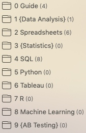
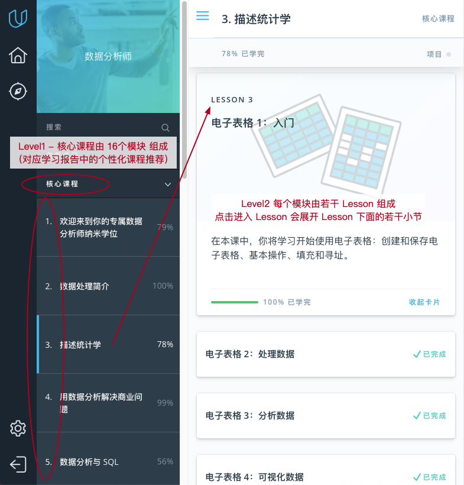
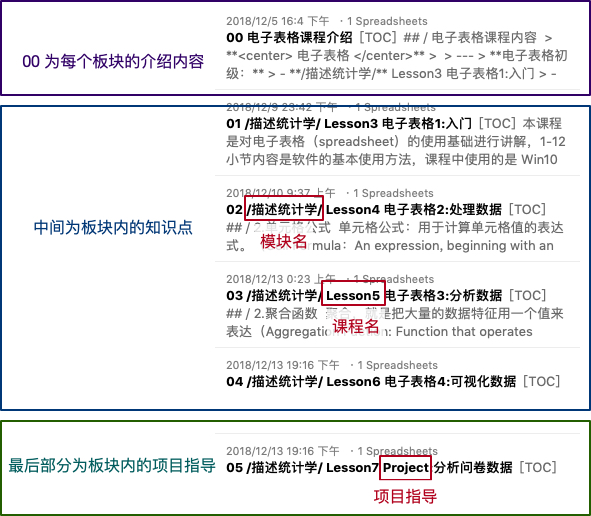
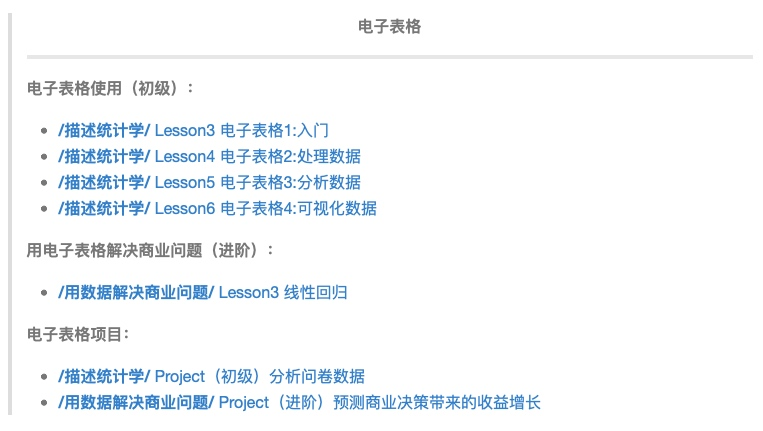

# 01 导学使用说明

## / 导学模块介绍

上图是SVIP导学的目录结构，0为说明板块，1-9为6个能力板块和3个知识板块（用{}扩了起来），板块详细说明：
- **0 Guide：** 课程导引板块，引导你如何结合课程内容使用这个导学体系。
- **1 {Data Analysis}：** 数据分析板块，结合课程多个部分，培养数据分析的思维方式。
- **2 Spreadsheets：** 电子表格技能板块，如何在工作中使用 Excel 完成数据分析。
- **3 {Statistics}：** 统计学板块，结合了课程中的多个部分，培养统计学的思维方式。本部分设计的项目会归在其他的能力板块中完成。
- **4 SQL：** SQL技能板块，分为初级、高级和一个项目。
- **5 Python：** Python技能板块，分为多个项目。
- **6 Tableau：** 敏捷可视化板块，学习如何使用Tableau完成数据的展示。
- **7 R：**R语言板块，除了 Python 另一个非常强大的编程语言。
- **8 Machine Learning：** 介绍机器学习的原理和基础知识，可以结合 Excel 和 Python 进行数据分析。
- **9 {AB Testing}：** 讲解商业中的AB测试知识，理解为什么AB测试能够帮助公司获得成功。

对于每一个知识板块，我们也来讲下组织结构，以`1 Spreadsheets` 为例：

## / 课程模块介绍

整体SVIP课程有 16个 模块，每个模块由若干 Lesson 组成：

## / 导学与课程模块对应关系

导学中能力板块：由介绍、课程指导和项目指导3部分组成。知识板块则由介绍、课程指导2部分组成（知识板块相关的项目归入相映的能力板块）。以 `1 Spreadsheets` 电子表格能力板块下的导学文件列表为例：

## / 技能学习分级

对于每个导学板块，会结合SVIP课程和项目做能力等级的拆分，并写入到每个板块 `00 xx介绍` 中，比如 `1 Spreadsheets`整体课程的内容拆分为了（初级）和（进阶）两个部分，以便对应不同目标的学习：

