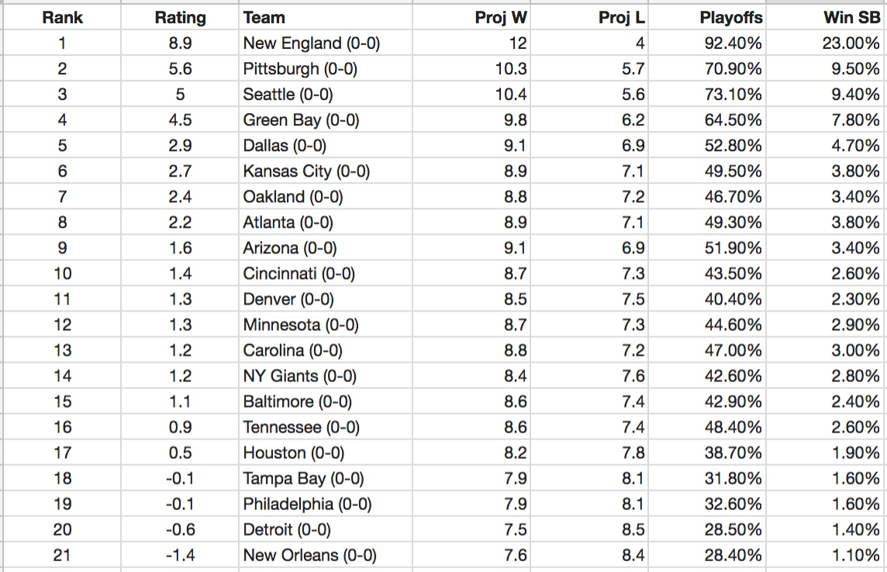
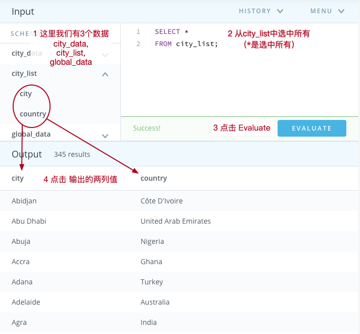

# 01 /数据处理简介/ Lesson1 数据处理

[**/数据处理简介/** Lesson1 数据处理](https://classroom.udacity.com/nanodegrees/nd002-cn-svip/parts/f5651cf0-56ac-4fdf-b588-45976f6cc1cd/modules/22b3ae26-a35c-46f2-94dd-a3a846d179a4/lessons/07b383df-b9dd-4e67-9baa-cbe1a4107bbf/concepts/1b6629c1-764a-4f70-9a9a-842d2f78007f)

本部分介绍了3个数据应用的场景。作为数据分析思维的入门，我们来看下在商业场景中，数据分析都能带来什么奇特的效果。（本部分课程内容不多，1天搞定是可以的。）需要指出的是，数据分析是一个十分悠久的手艺了，涉及的工具也有不少，并没有一个固定的工具。当然最常用的是以下4种：电子表格、SQL、Python、R。好消息是这几种工具在我们的课程中都有涉及，并且会循序渐进逐渐讲解。

## / 2.访谈故事 1:Sparta Science

你熟悉橄榄球么？（美式足球）在高强度的训练和激烈的比赛中，伴随着运动员的除了荣誉还有大量的伤痛。伤痛不但会给运动员带来负面影响，也会给球队带来巨大的损失。Sparta Science 通过应力版收集队员不同状态的受力情况并根据他们的其他特点辅助训练和康复计划，从而让球队整体表现更加出色，很神奇吧？当有了准确的测量和算法，数据往往比感觉更加可靠。

## / 3.Excel中的运动数据

这里大家会看到 Excel 数据表格的样子：

但是后面这几列数据是什么意思呢（尤其是最后那两个大写的字母……北方汉子表示……很熟悉啊）。其实一般来讲我们拿到数据的时候，每一行叫一条记录，每一列叫一个特征（Feature）。对于特征，一般是有一个数据字典做解释的。在这节的后面的练习有一些解释：
- Projected：预计胜数
- Playoff Wins：赛季后胜率

## / 4.访谈故事 2:Farmer Mitch

这节是一位名为 Mitch 农民大叔的故事，当这位大叔站在他家的地里和你谈论化学反应、代数、线性代数和他对农业中浪费问题的时候，你会不会觉得也按捺不住学习的欲~~火~~望？从我看来，数据分析技能很快就要发展成基础技能了，工作中拍脑袋的时代会愈来愈快的苍白，没有数据的支撑，工作很难开展。而且，即使就算工作中实际敲代码做数据分析的机会比较少，数据分析的思维也将对一个人的工作有诸多裨益（越是决策多的岗位就越需要）。

## / 5.SQL中的天气数据

这里大家会接触到 Udacity 的 SQL 工作空间，咱们会在后面的知识详细讲解，大家看个大概就可以了（线上完全可以完成）：

## / 6.访谈故事3:不同寻常

这一节提到了用户画像以及推荐系统。其实双十一购物平台早就在使用这个技术，你搜索一些东西之后，你看到的推荐商品就会发生变化。（什么？你说你光看视频里的小姐姐了……）