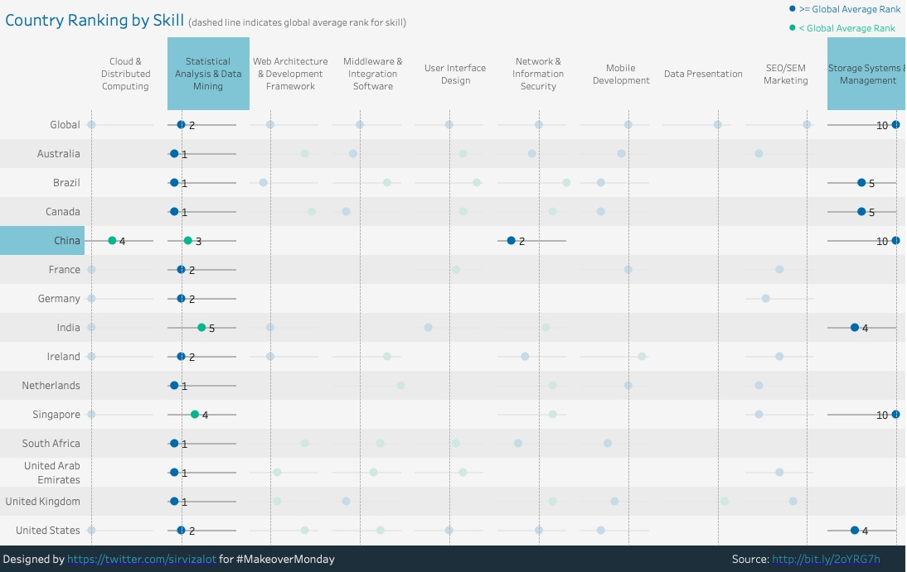

# 02 /数据处理简介/ Project 观察数据可视化面板完成分析报告

[/Project:观察数据可视化面板完成分析报告/](https://classroom.udacity.com/nanodegrees/nd002-cn-svip/parts/f5651cf0-56ac-4fdf-b588-45976f6cc1cd/modules/22b3ae26-a35c-46f2-94dd-a3a846d179a4/lessons/336e9d9f-3252-4af8-9d47-bd0410a56ad5/concepts/0d8e8912-baeb-490c-b944-cbb91808a6f5)

[TOC]

## / 2.项目描述

数据分析工作的很大一部内容是能够向别人解释数据可视化，并阐述你的见解。为了让你做一些练习，我们选择了一些 Tableau 仪表板供你练手，具体链接如下。要完成本项目，你需要：

  1. 请选择 **其中一个** 你最感兴趣的仪表盘 (dashboard)。
  2. 在对应仪表盘中的可视化中找出 **三条见解**。
  3. 对于每条见解，请**提供静态图像**，分享你的观察发现。写一份简短的报告，解释你的每次发现以及你是如何在报表中找到能够得出你的结论的信息。
  4. 包括图像，你的报告长度应该为1-2页。

大家好啊，我们到了课程的第一个项目了，Tableau是一个很酷的软件，能够在数据上快速生成优雅的互动数据（后续选学项目可以选学习这个软件）。链接如下：
- [Madrid in Detail](https://public.tableau.com/en-us/s/gallery/madrid-details?gallery=featured)
- [Malaria in Africa](https://public.tableau.com/en-us/s/gallery/malaria-africa?gallery=featured)
- [LinkedIn Top Skills](https://public.tableau.com/profile/matt.chambers#!/vizhome/LinkedInTopSkills2016-MakeoverMonday/LinkedInTopSkills2016-MakeoverMonday) 对于这个数据商业价值，可以参看：[这篇文章](https://blog.linkedin.com/2016/10/20/top-skills-2016-week-of-learning-linkedin)

另外，Udacity的每个项目，都有一个详细的审阅标准，比如[/这个项目的评审标准/](https://review.udacity.com/#!/rubrics/2100/view)。当你对项目有些懵或者对于项目的完成有些拿不准的时候，参考审阅标准也可以帮助你理解项目设计的意义和项目考察的详细知识点。

## / Tips

- Tableau的图是互动的，可以点击。
- 点击的时候可以按住 control / command 选中多个。
- 对于提交的文件没有要求，不过比较通用的是 pdf 文件，用 word 也可以的，不过在对外发布的时候 pdf 更通用也能更能保护源文件（ pdf 文件不好修改）。
- 如果会 markdown 语言，或者对 markdown 感兴趣，可以尝试用 markdown 写，导出 pdf 后提交项目。（ markdown 在后续项目遇到时候会用到一点，是一种专注于内容的书写方式）
- markdown 的话推荐 Typora，Win 和 Mac 都有。
- **文件名不能有中文！！！** 

这是我从 Linkedin 数据中的一张截图，大家想知道我的故事么？
