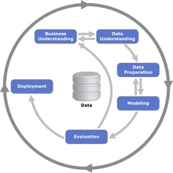
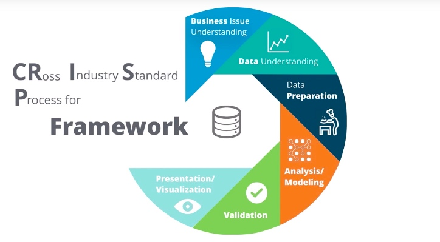
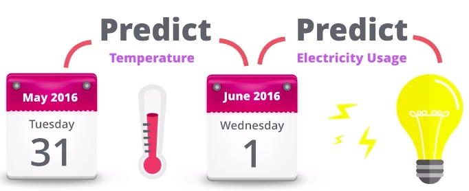
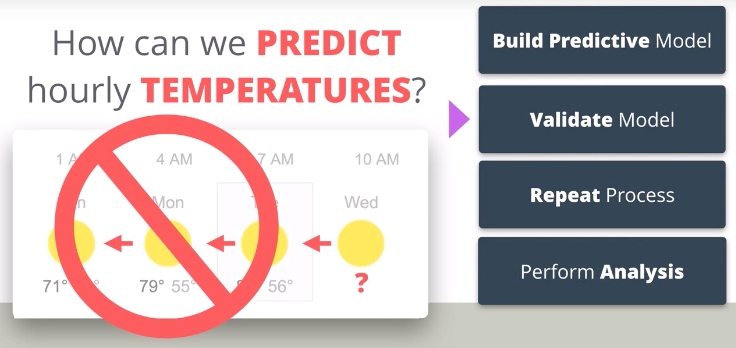
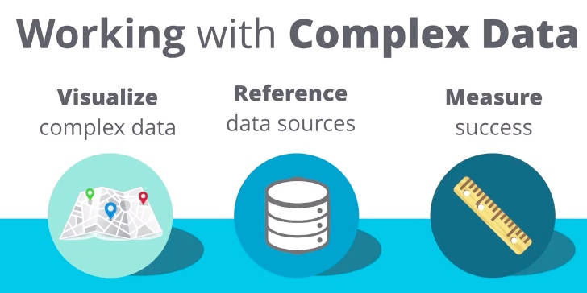

# 03 /用数据解决商业问题/ Lesson1 分析问题解决框架

[**/用数据解决商业问题/** Lesson1 分析问题解决框架](https://classroom.udacity.com/nanodegrees/nd002-cn-svip/parts/040afa6c-3c5d-4b44-bdd0-b420a0455145/modules/8f120816-9158-4429-8c7d-032a66dc6b22/lessons/dd7bf461-dfec-484c-b932-d09744913c98/concepts/e6fc0947-3119-4a9d-b78a-92be1ea6d8d6)

[TOC]

## / 1.课程简介

这一节课，和后面的一节的特点是从案例（清洁机器人）出发，让你能够通过这个案例（虽然是编订的，但是非常精致）对实际工作中的场景有一个深刻的认识。**切记：对于案例的理解和思考和技能同等重要。**

> 商业问题：
下个月我们将与一位新客户开展一项大型交易，我们要以优质的服务水平为他们提供支持。我需要知道每周平均会从此客户获得多少工单，以确保帮助台有足够的资源。

其实就是分为了以下几点：
- 解决问题的策略（框架和套路是什么）
- 非预测性数据分析（描述统计学相关，对现有的数据进行分析）
- 预测分析（推论统计学相关，根据数据，对未来进行预测分析）
    - 线性回归（预测分析的一种工具，属于机器学习大板块下的内容）

## / 2.问题解决框架: CRISP-DM

CRISP-DM是跨行业数据挖掘的简写，是一个数据挖掘的框架（套路），wiki链接，和示意图如下：
[/Cross-industry standard process for data mining/](https://en.wikipedia.org/wiki/Cross-industry_standard_process_for_data_mining)

相比之下还是课程中的图帅气，也叫CRISP Framework：

CRISP-DM 步骤
- 业务理解 Business Issue Understanding
- 数据理解 Data Understanding
- 数据准备 Data Preparation
- 分析/建模 Analysis/Modeling
- 模型评估 Validation
- 模型发布/可视化 Presentation/Visualization

## / 3.业务理解

业务理解对数据分析非常重要，英文叫 Business Issue Understanding（业务问题理解），这个 Issue 说明了业务理解的对象是非常具体的 Issue，要想解决这个 Issue，需要回答以下3个问题：

1. 需要做出哪些决策？
2. 需要获得哪些信息，来做出这些决策？
3. 什么类型的分析能够获取决策所需的信息？

## / 4.数据理解

接下来就是数据理解阶段（电力公司的例子非常有意思）：
> “数据理解阶段从数据收集活动开始，然后借由一些活动来熟悉数据、检测数据质量问题、对数据进行初步理解，或探索数据中比较有趣的数据子集，进而形成对潜在信息的假设。” —— 维基百科

这里要回答3个问题：
1. 需要什么数据？
2. 有什么数据可用？
3. 数据的重要特征是什么？

## / 5.数据准备

> 数据准备
“数据准备阶段涵盖了从原始粗糙数据中构建最终数据集（将作为建模工具的分析对象）的全部工作。数据准备工作有可能被实施多次，而且其实施顺序并不是预先规定好的。这一阶段的任务主要包括：制表、记录、数据变量的选择和转换，以及为适应建模工具而进行的数据清理等等。” —— 维基百科

课程中的一句话亮了：

> 如果补进行一些准备，数据很少能直接使用。

甚至有种说法，数据清理（数据准备）的时间占比大于分析数据的时间。数据整理确实有很大工作量，但是也有套路可循，将会在后续Python语言中重点讲解。对于Excel大家了解课程内容即可。

数据准备的常用步骤:
1. 收集：收集数据时，你可能需要从组织内的多个来源收集数据。
2. 清理：你使用的数据集可能有一些问题需要在分析之前解决。这可能包括数据不正确或丢失。
3. 格式化：你可能需要通过更改日期字段的显示方式，重命名字段，甚至旋转数据来格式化数据，类似于使用数据透视表。
4. 混合：你可能希望将数据与其他数据集进行混合或组合，以增加其他变量，类似于在 Excel 中使用 VLOOKUP 函数。
5. 数据抽样：最后，你可能需要对数据集进行取样，并使用更易于管理的记录数。(抽样是否没有偏见对于数据分析非常重要）

## / 6.分析与建模

> 分析/建模：
“在这一阶段，你要选择和应用各种各样的建模方法，并将模型的参数校准为最佳值。通常情况下，同一种数据挖掘问题类型有多种适用的方法。一些建模方法对数据形式有具体的要求。因此，往往需要返回数据准备阶段。” —— 维基百科

重要步骤:
1. 确定用什么方法来解决问题
2. 确定有助于解决问题的重要因素或变量（见后面图，一图顶千言，画图可以有助于思考）
3. 构建解决问题的模型(Build Predictive Model)
4. 运行模型并移至模型评估阶段(Validate Model是下节的内容)

## / 7.模型评估

> 模型评估：
“在项目的这一阶段，你已经有一个或多个，从数据分析角度看，具有较高质量的模型。在进行模型的最终部署之前，务必要更全面地评估模型，并检查构建模型所执行的步骤，确保其能正确实现业务目标。一个关键目标是确定是否存在一些尚未充分考虑的重要业务问题。在此阶段结束时，应对数据挖掘结果的使用做出决定。” —— 维基百科

重要步骤:
1. 观察模型上的关键结果
2. 确保结果在业务问题的情境中有意义
3. 确定是否继续下面的步骤还是返回上一阶段
4. 必要时重复多次

## / 8.模型发布和可视化

> 模型发布和可视化:
“创建好模型并不意味着项目结束。即使模型的目的是提高对数据的理解，所获得的理解仍然需要以一种对客户有用的方式被组织和呈现。根据需求的不同，部署阶段可以简单到只是生成一份报告，也可以非常复杂，像实现可重复的数据存储（例如分段分配 segment allocation）或者数据挖掘过程。在许多情况下，往往是客户而非数据分析师执行部署步骤。即使由分析师部署了模型，客户也必须了解需要执行的操作，以便实际利用已构建的模型。” —— 维基百科

主要注意事项:
1. 根据分析，确定呈现见解的最佳方式
2. 根据观众，确定呈现见解的最佳方式
3. 确保共享的信息不要过量
4. 使用结果向观众讲述故事
5. 对于更复杂的分析，你可能需要向观众演示分析问题解决过程
6. 始终注明使用的数据源出处
7. 确保你的分析支持需要做出的决策

这一节的两个重点（这节讲的展示数据非常重要！）

- 在讲解复杂数据的时候，可以按照 视觉展示-数据说明-衡量标准来传达给你的听众：

- 请用一个故事（或者场景）贯穿你的讲述，故事人人爱啊：

