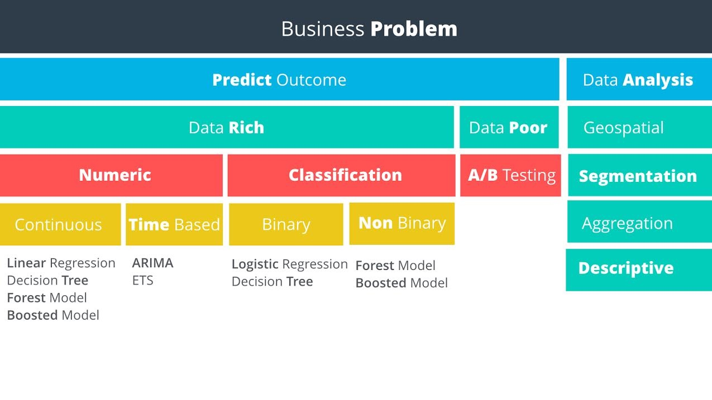
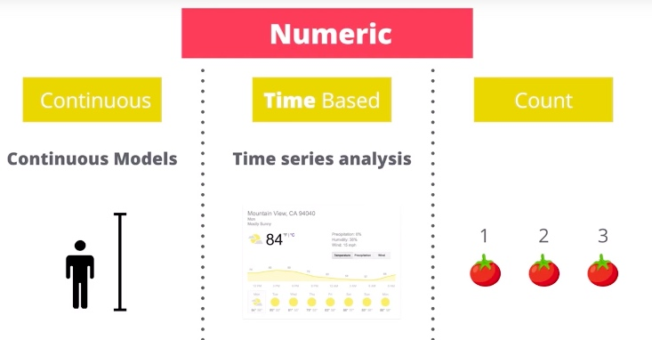

# 04 /用数据解决商业问题/ Lesson2 选择分析方法

[**/用数据解决商业问题/** 课程链接：Lesson2 选择分析方法](https://classroom.udacity.com/nanodegrees/nd002-cn-svip/parts/040afa6c-3c5d-4b44-bdd0-b420a0455145/modules/b0429ace-8f83-4cb4-afae-baf05841231e/lessons/74e0bf7f-8607-4e14-bad2-ba5dfe64bd5c/concepts/c1a91555-1da3-418d-8a2f-6ea1e17575a6)

[TOC]

## / 1.选择分析方法

问题解决框架有助于系统地解决商业问题，但是它无法帮助我们了解具体该使用哪种方法。这个时候我们就要使用 **“方法图（Methodology Map）”**来做出选择：

## / 2.非预测性商业问题

这节对上图右边的非预测性的商业问题的4个小类做了描述，4个视频非常直观请认真观看：

- **地理空间分析（Geospatial Analysis）：**这种类型的分析使用基于地理位置的数据来推导结论。例子有：通过地理区域识别客户，计算店铺之间的距离以及根据客户位置创建交易区域。
- **细分分析（Segmentation Analysis）：**细分是将数据分组的过程。分组可以是简单的，比如购买不同东西的客户，也可以是复杂的，比如根据客户的人口特征统计来识别相似的店铺。
- **聚合分析（Aggregation Analysis）：**此方法用于计算跨组或跨维度的数据，在数据分析中很常用。举例来说，你可能想要某个销售员的月度销售汇总，将其每个月的销售额相加即可。然后，你可能需要跨维度进行汇总，比如各销售领域的月度销售汇总。聚合通常用于报告，以达到划分和区别信息的作用，有助于管理层制定决策和观察表现。
- **描述性分析（Descriptive Analysis）：**描述性统计可提供一个数据样本的简单概括。比如说计算一所学校申请者的平均 GPA，或者计算一个职业棒球员的击球平均水平。在我们的电力供应案例中，我们可以使用描述性统计来计算每小时、每天或某一天的平均温度。

Tips：最后的描述性分析是衡量数据的离散程度的（就是每个数据点的和平均值的差异大小）。从聚合（第3个）和离散（第4个）就能对数据有一个比较全面的了解了。

PS：这里课程中还有描述统计学的一个入门（Free）Lesson链接，内容已经包括在本套课程中了，大家不用点击（不过可以分享给别人）。[/描述统计学入门/](https://cn.udacity.com/course/intro-to-descriptive-statistics--ud827)

## / 5.数据不足的商业问题

当数据不足的时候，就需要做AB测试来完成数据的收集。
PS：课程中提到的[/A/B 测试课程/](https://cn.udacity.com/course/ab-testing--ud257)免费课已经包含在了整体课程中，这里不用看。

## / 6.数据丰富的商业问题

当有足够数据的时候，我们就可以根据目的进行回归分析了。如果是需要预测数值，就用回归模型；如果需要预测分类（是、否这样的），就用分类模型：

回归模型（Regression Models）:
> 数值型结果是那些用数字表示的结果。预测供电量或者每小时温度都属于数值型结果。预测数值型数据的模型被称为回归模型。

分类模型（Classification Models）
> 非数值型结果是那些我们要预测案例或客户所属类型的结果，比如客户是按时付款、延期付款还是拖欠贷款。另一个例子是：某电子设备是否会在 1000 个小时内出故障。预测非数值型数据的模型被称为分类模型。

## / 7. 数值型和非数值型结果

这节就是3个场景，理解下什么时候用回归模型解决，什么时候用分类模型解决：

三轮车制造商的生产部门
> 在第一个例子中，假设制造商想要利用历史生产数据来预测，在未来六个月内，他们需要生产多少三轮车来满足市场需求。因为制造商想要预测的结果是一个数字，目标变量是数值型。因此，他们需要用数值型或回归模型来解决这个问题。

Hot & Fresh Pizza 的市场部门
> 第二个例子中，Hot & Fresh Pizza 想用他们现有店铺的销售数据和这些店铺相应的周边人口统计数据来预测他们位于某地的新店能卖多少披萨。因为 Hot & Fresh Pizza 想要预测的是披萨的数量，目标变量是数值型。因此，他们需要用数值型或回归模型来解决这个问题。

银行的风险管理部门：
>第三个例子中，银行想要用他们客户的历史数据来预测一个新客户会拖欠贷款、总是按时还贷还是有时按时还贷。因为银行想要的结论是预测新客户的类型，所以他们需要用非数值型或分类模型来解决这个问题。

## / 8.数值型模型介绍

课程上来引入了一个概念：**目标变量（Target Variables）**
> 目标变量代表需要预测的结果。为了选择正确的预测模型，我们首先要确定目标变量是数值型还是非数值型。让我们先从数值型变量开始。

简单说的话，目标变量就是你要预测的那个量，无论是准备进货冰激凌的个数或者房屋价格的预测。目标变量也叫因变量，因为他总是根据输入变量而变化的。而输入变量也叫作自变量，因为他是目标变化变化的原因。因变量和自变量的说法在后续有些课程中有提到，其实是一回事。

如上图，数值型变量（Numeric Variables）主要分为这3个小类：
- **连续型（Continuous）：**连续型变量能包含一个范围内的所有数值。打个比方，你的身高能测量到多个小数位的精度，我们不会以每英寸的间隔成长。
- **基于时间型（Time-Based）：**基于时间的数值型变量是预测在某一段时间内会发生什么的一种变量，常常与“预报”有关。
- **计数型（Count）：**计数型变量是离散的正整数。它们被称为计数数字是因为被用来分析能够计数的变量。在商业中这类型的变量并不常见，我们不会在课程中涵盖这部分的内容。

## / 10.非数值型模型介绍

在处理非数值型变量（Non-Numeric Variables）：
> 非数值型变量常常被称为分类（categorical）变量，因为变量的值用离散数字来表现可能的数值和类别。比如电子设备是否会在 1000 个小时内出故障；或者一个客户将会按时付款、拖延付款还是拖欠付款；或者某店铺被划分为大、中、小三种类型之一。

这里的一个点就是要区分如何使用二元和非二元变量（Binary and Non-Binary）：

> 当给分类变量建模时，可能的结果数量是一个重要参数。如果只有两种可能的分类结果，比如是和否，或者对和错，那么这个变量就被称为二元变量。

> 如果有多于两种的分类结果，比如小、中、大或者按时付款、拖延付款、拖欠付款，那么该变量就被称为是非二元变量。这节课的重要内容是要能够决定是否使用分类模型以及是否应该使用二元模型或非二元模型。