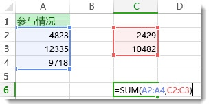
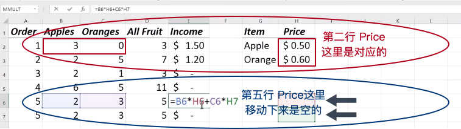

# 01 /描述统计学/ Lesson3 电子表格1:入门

[TOC]

本课程是对电子表格（spreadsheet）的使用基础进行讲解，1-12小节内容是软件的基本使用方法，课程中使用的是 Win10 环境下的 Office Excel 2016，比较熟悉的可以跳过，直接看13小节之后的内容即可。

## / 13.区域寻址

区域：一组单元格（Range：Group of cells selected or addressed together)。要想选中区域可以用鼠标拖动，也可以在输入公式时指定，对于区域寻址有以下3个小知识点（将在这节和后面几节介绍）：

> Range Addressing
> - Column and row labels 理解行和列的标识方法
> - Named ranges 命名区域
> - Relative vs. Absolute 相对地址和绝对地址

课程下面文字部分有 Microsoft Office 的一个链接，善于使用一个软件的官方文档能够提高技能的掌握速度，而且现在的软件功能繁杂，在工作中根据需要解决的问题查询学习是非常必要的。比如课程中的参考链接：[/使用 SUM 函数对区域中的数字求和/](https://support.office.com/zh-cn/article/%E4%BD%BF%E7%94%A8-SUM-%E5%87%BD%E6%95%B0%E5%AF%B9%E5%8C%BA%E5%9F%9F%E4%B8%AD%E7%9A%84%E6%95%B0%E5%AD%97%E6%B1%82%E5%92%8C-323569b2-0d2b-4e7b-b2f8-b433f9f0ac96)对于SUM和区域结合使用就有详细的描述（摘录如下）：

- SUM可以将多个区域进行求和：

- 怎样创建公式：
    - 在单元格中后, 跟一个左括号（键入= SUM 。
    - 若要输入第一个公式范围，称为参数（公式需要运行的数据块），键入在 a2: a4 （或选择单元格 A2，然后拖动到单元格 A6）。
    - 键入逗号 (,) 以将第一个参数与下一个参数分隔开。
    - 键入第二个参数， c2: c3 （或拖动以选择的单元格）。
    - 键入一个右括号 )，然后按 Enter。
- SUM的每个参数可以是区域、数字或单个单元格引用，均用逗号分隔，以下几种都是对的：
    - =SUM(A2:A4,2429,10482)
    - =SUM(4823,A3:A4,C2:C3)
    - =SUM(4823,12335,9718,C2:C3)
    - =SUM(A2,A3,A4,2429,10482)

## / 15.相对于绝对寻址

相对寻址：单元格的位置和答案的位置是相对的（Relative Address：The cell locations are relative to the answer cell that references them.）

课程中计算 `总价 = 数量 * 单价` 的时候，因为 Excel 复制带公式的单元格时，对于相对地址位置根据做调整，所以会有乌龙出现：

    
这时候，就需要引入另一种寻址方式：
绝对地址：固定的单元格位置，当复制和更改时不会变化。（Absolute Address：Fixd cell or range address that doesn't change when copied.)方式只需要在需要固定的地址（行或列）前面加一个 `$` 就可以了。[/在相对引用、绝对引用和混合引用间切换/](https://support.office.com/zh-cn/article/%E5%9C%A8%E7%9B%B8%E5%AF%B9%E5%BC%95%E7%94%A8%E3%80%81%E7%BB%9D%E5%AF%B9%E5%BC%95%E7%94%A8%E5%92%8C%E6%B7%B7%E5%90%88%E5%BC%95%E7%94%A8%E9%97%B4%E5%88%87%E6%8D%A2-dfec08cd-ae65-4f56-839e-5f0d8d0baca9)

## / 19.保存数据

- 线上电子表格（google doc、icloud numbers、office365）会自动保存数据。
- 桌面版本（安装在自己电脑上的）需要注意以下3方面：
    - control + s（Windows系统），command + s（Mac系统）进行保存，如果是从只读文件打开会提示询问存储位置和文件名
    - Excel 有个设置可以打开自动保存，Mac的界面如下：

    

    - 选择文件，另存为能够存储为其他电子表格格式，便于分享