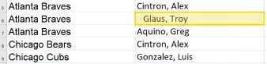

# 02 /描述统计学/ Lesson4 电子表格2:处理数据

[TOC]

## / 2.单元格公式

单元格公式：用于计算单元格值的表达式。（Cell Formula：An expression, beginning with an **EQUAL SIGN** (=), that defines the operations which calculated the value for the cell.）

在实际使用时，我们经常在一个单元格创建公式（=开头），在使用复制方式填充一行或一列得到相应其他的公式，从而计算出需要的一系列值。公式中可以时常量、数学运算符或函数，也可以引用单个或一系列单元格：

> `=5`
`=5+3`
`=$B$3` 这是在上节讲过的绝对地址
`=FUNCTION(parm1, parm2)` 这里的FUNCTION指函数，parm指这个函数中的参数。

接下来我们讲下函数，函数是 Excel 的内置功能，可以根据输入内容计算值（Fuction：A standard-defined routine that can be used in formulas):
- 函数以某些关键字开头（例如SUM求和，AVERAGE求平均数，TRIM去掉多余空格函数）（ps：TRIM在Office中文帮助中没有，英文帮助有）

参数是有函数规定的，计算函数值的所需输入。可以是常量、单元格引用或区域引用或者其他函数（嵌套）。（Parameter：Value or expressions required by a function to determine a result，defined by the fuction.)

课程中使用的 Windows Office 2016，如果使用的是 Mac Office 2016，界面如下：

PS：超过400种的函数说明如下：[/Excel 函数（按类别列出）/](https://support.office.com/zh-cn/article/Excel-%E5%87%BD%E6%95%B0%EF%BC%88%E6%8C%89%E7%B1%BB%E5%88%AB%E5%88%97%E5%87%BA%EF%BC%89-5f91f4e9-7b42-46d2-9bd1-63f26a86c0eb)

## / 4.SUBSTITUTE 文本函数

文本函数 SUBSTITUTE 是专门处理文本字符串的。文本字符串的定义是：Text String - String of letters, Numbers, and punctuation that is not treated numerically. 文本字符串可能包含以下内容：
- Names
- Phrases
- Cities
- Countries
- Not a date or number

> 同为文本处理，SUBSTITUTE 和 Find + Replace 的区别：
> - 不改变原始数据
> - 在新的单元格中存储转换的数据

## / 6.提取文本

这一节的三个重点，课程视频中比较清楚。以下用 Mac 示例作为补充，单元格地址也和课程不同：

- 1 FIND函数

- 2 LEFT函数（MIN和RIGHT函数类似）

- 3 函数的嵌套（把FIND嵌套到LEFT中）

// 7.练习：提取文本

这节练习是使用之前的FIND、单元格运算、MID完成。最后的整合是用一个嵌套公式完成输出，比较长，请细心。提示如下：

PS：一个中文字符是算两位，如果想统一需要使用MIDB处理：[/MID和MIDB区别/](https://support.office.com/zh-cn/article/mid、midb-函数-d5f9e25c-d7d6-472e-b568-4ecb12433028)

这里练习的最后一个是吧前面的嵌套单元格做整合：
`FIND(" ",A2,FIND("data",A2,1)+LEN("data")+1) - (FIND("data",A2,1)+LEN("data")+1)` 大家注意到了那两个 `+1` 了么？可以去掉。最终变成：
`FIND(" ",A2,FIND("data",A2,1)+LEN("data")) - (FIND("data",A2,1)+LEN("data"))`

// 8.调整文本格式

这节介绍了5个新的函数：
- CONCATENATE 是将单元格中的文字结合的函数
- TRIM 是去掉多余空格的函数
- PROPER、UPPER、LOWER 是修改文字大小写的函数，对比如下：

// 10.数学函数

本节内容和下节练习针对的是：`=SUM()` 和 `=AVERAGE()` 函数做求和和平均的计算，这是内置函数。同时另一种`=B2+B3`这种直接单元格运算的是另一种实现数学运算的方法。

// 12.重复行

在这一节，我们进入到了一个新的环节，如何得到干净的数据。（
Clean Data：Data that is free of corrupt or inaccurate data items.）干净的数据是数据分析的重要前提，无论使用的 Excel 电子表格，还是后面会使用的 Python 编程语言，这一步都是数据分析前的重点环节。

让我么从处理重复行开始，课程中的这个名字前面加了一个空格的情况，会在处理时造成问题，因为计算机会把‘ Glasu’和‘Glasu’当作两个不同的人进行处理：

或者是这样，大小写不一样的（处理方法见上节中的字符串方法）：

// 13.练习：重复行

补充一点，Mac Excel 的删除重复行的功能在屏幕顶的菜单中，点击之后会提示有多少重复行，确认即可删除：

// 14.拆分列

补充一点， Mac Excel 的拆分列在屏幕顶菜单的数据中。Office365 无此功能。

// 17.练习：数据排序

Mac 的同学请跳过，程序会崩溃。Office365排序不会将其他单元格的内容一同移动，会产生数据错位。

// 18.筛选数据

选出某个特征的数据并忽略其他数据（Filter：Method to group data by selecting characteristics of one or more columns in a data set.)

Mac的筛选器仍然需要到顶层菜单打开（导航右侧的不生效）。之后会生成一个向下的小箭头，点击箭头可以选择筛选的内容。注意在这里是可以搜索的，在内容很多时非常方便。

请注意，筛选不但可以多个一起进行，而且筛选的条件可以是一个判断，比如后面练习中寻找名字为J开头的球员：

最后的问题需要结合AVERAGE函数，并且先把过滤出来的数值COPY到别的位置完成。

**PS：特别提示，在MAC下：**
- 如果遇到筛选、排序会退出的情况。请尝试不选中列，只选中需要排序的单元格再做尝试。
- 如果出现MAC软件上面Ribon不可见，可以点击右上角的 `^` 两次，收起再打开完成。