# 03 /描述统计学/ Lesson5 电子表格3:分析数据

[TOC]

## / 2.聚合函数

聚合，就是把大量的数据特征用一个值来表达（Aggregation Fuction: Function that operates across a group of data resulting in a single value)，有以下5个值：
- SUM 求和
- AVERAGE 平均数
- MAX 最大值
- MIN 最小值
- MEDIAN 中值（把数据从小到大排序，排在中间的那个值）
- STDEV 标准差（衡量每个值和平均值差异，差异越大，标准差越大）

其中 SUM 已经在前面使用过了，其他的用法和 SUM 一样。除了聚合函数，课程 1:50 开始还介绍了怎么快速建立条形图（Bar Chart）：
- 选中数据
- ‘Insert’-‘Bar Chart’ 生成条形图
- ‘Design’ 可以修改默认样式

## / 4.逻辑函数：IF 函数

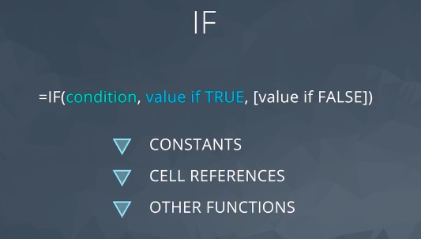

IF 是编程中通用的条件判断关键字。代表如果达到条件执行一件事，如果达不到条件则执行另一件事。参照上面的语法：
- condition 是判断的条件
- value if TRUE 如果判断为真（通过判断）就执行这里的语句
- [value if FALSE] 如果判断为假（没通过判断）就执行这里的语句，注意用[ ]扩起来的意思是说，这个部分可以不写，则在判断为假的时候不执行任何操作。需要注意的是，如果省略了但条件判断为假，则会输出 False。

课程中的例子也是这样：
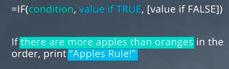

课程中的实操的例子中使用了 > 大于号作为**比较运算符**（Comparison Operator: Compare the relative size of equality of two values with these operators - Result is a logical value either TRUE of FALSE)。需要注意一点，比较运算符的输出为 TRUE 或 FALSE，共有以下几种：
- > Greater than 大于
- < Less than 小于
- = Equal 等于
- >= Greater thatn or equal 大于等于
- <= Less than or equal 小于等于
- <> Not equal 不等于

## / 6.逻辑函数：AND、OR、NOT

AND 和 IF 一样是函数（函数的参数在小括弧中，Excel 中看到小括弧就是函数），是把多个条件的真假一起考虑，全部为真则输出真，否则就输出假：

` =AND(condition1,condition2,...) `

三种逻辑函数的总结：
- AND: true if **all** conditions are true
- OR: true if **any** condition is true
- NOT: **reverses** true and false

当然，逻辑函数最常见的是和IF一起使用:

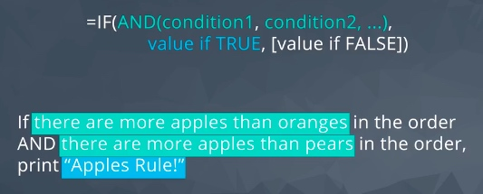

## / 7.练习：逻辑函数

对于3个条件，我们来进行拆解：

- 如果一个订单中任意一种水果的最大数量超过 10 件，`A1:D1>10`
- 或订单中的总水果量超过 20 件，`E1>10`(注意这两个条件要用`OR()` 包裹起来
- 则将其标记为 "Special Order"，否则，则标记为 "No"。用IF嵌套AND表达。

PS:出错的怎么办：
- 公式出错的话会在单元格中出现`#VALUE!`
- 同时左边出现小三角可以帮助定位错误，点击后会有提示：

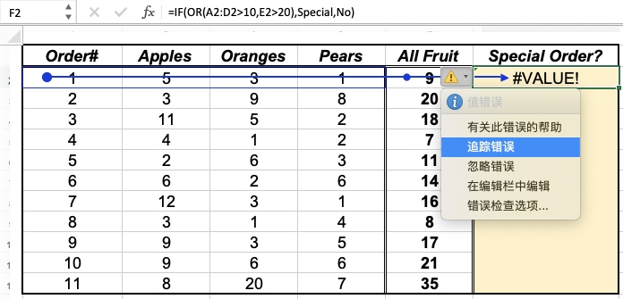

- 可以在其他单元格将公式进行拆分，一步一步定位错误
    -  比如所我开始写了`OR(A1:A4>10)`报错
    -  其实原因是不支持A1:A4这种范围的比较
    -  需要每个都比较，再用逗号分隔（测试了3次，搞定）：
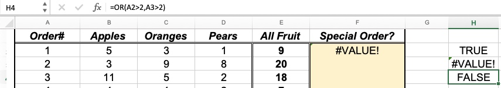

- 注意IF判断之后要显示的文字要用双引号扩起来
- 当出错的时候，点击fx打开公式生成器一点一点排错很有帮助（可以看到嵌套中的结果）：

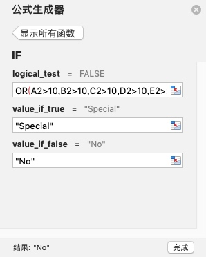

## / 8.条件聚合函数

将条件和聚合函数嵌套，就得到了条件聚合函数（Conditional Aggregation Function: Function that operates across a group of data with logical conditions）。

课程中的 COUNTIF 和 SUMIF 的区别是，前者是数有几个，后者是求和，扩展链接：
[/COUNTIF 函数/](https://support.office.com/zh-cn/article/COUNTIF-%E5%87%BD%E6%95%B0-E0DE10C6-F885-4E71-ABB4-1F464816DF34)
[/SUMIF 函数/](https://support.office.com/zh-cn/article/SUMIF-%E5%87%BD%E6%95%B0-169B8C99-C05C-4483-A712-1697A653039B)

## / 9.练习：COUNTIF、SUMIF 函数

这节请注意 SUMIF 有3个参数：判断范围、判断条件、求和范围。另外，如果是在 MAC Office 上，所有涉及公式累的编辑和存储，建议完成后存储为 xlsx 格式，否则csv会丢失公式信息。

## / 10.数据透视表

数据透视表是 Excel 非常强大的功能，一次输入数据，可以根据选择进行各种筛选和展示。（有点像Tableau这种敏捷BI程序，这个后续专门课程会讲）。MAC 打开数据透视表的方式是：

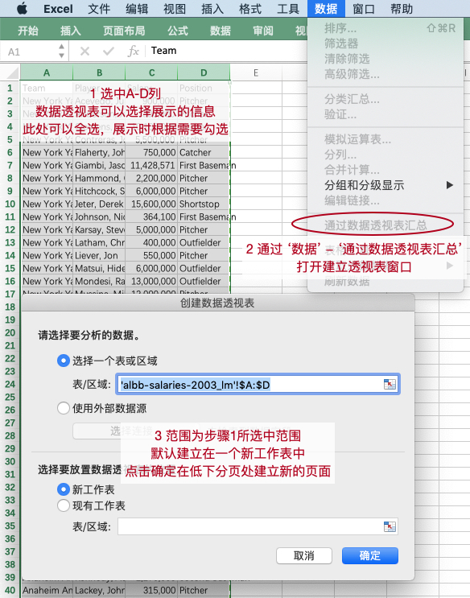

## / 11.练习：数据透视表

数据透视表有些复杂，练习请一定要完成，练习中的计算salary的提示如下：

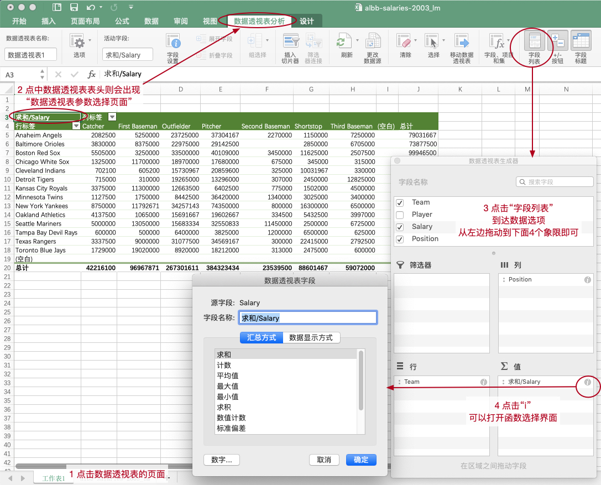

## / 12.命名区域

MAC 和 Windows 的‘命名区域’位置相同：

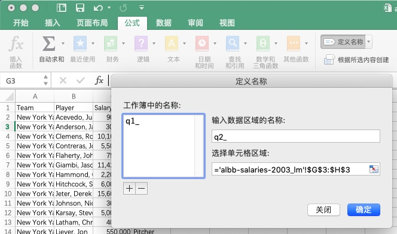

## / 14.Lookup函数

Lookup 是可以使用关键字在表格中查询其他信息的函数，包括LOOKUP（按行查找 Horizontal）和 VLOOKUP（按列查找 Vertical）（Lookup Function: Function that uses a keyword and index to "Look up" a value in a table.）

[/LOOKUP 函数/](https://support.office.com/zh-cn/article/LOOKUP-%E5%87%BD%E6%95%B0-446D94AF-663B-451D-8251-369D5E3864CB)

## / 15.练习：VLOOKUP函数

练习按照 check list 分解做就可以了。注意要先创建2个‘命名区域’，再做VLOOKUP，在选择VLOOKUP的第二个参数时，就可以看到创建的 `airline_lookup` 和 `airport_lookup` 两个参数（MAC）：

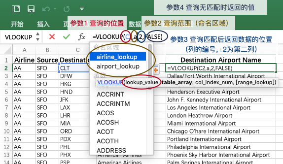

问题提示：
**Q1 伦敦:** 
- 在完成 VLOOKUP 之后，使用 COUNTIF ，注意检查判断条件，题目中的 London Heathrow 的拼写和数据中是否一致。

**Q2 唯一的航空公司:**
- 方法1：使用数据透视表 + COUNTA
    - 使用数据透视表可以将每个航空公司出现的次数计算出来（可以看出来那家航空公司的飞行的次数比较多）：
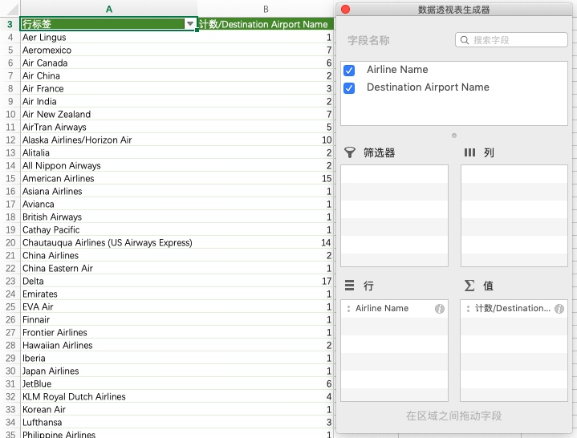
    - 对输出结果用 `COUNTA` 函数计算值的数量
- 方法2：高级过滤 + COUNTA
    - 使用‘高级过滤’将独特的数据过滤出来到新的位置（图中的例子是数不同的目的地机场，请同学们理解后自己完成不同航空公司的问题）：
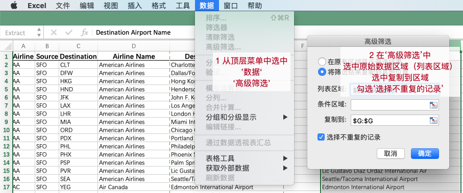
    - 对输出结果用 `COUNTA` 函数计算值的数量
    - 这种方式的区别是所有非独特值都依次有输出，可以copy文字道别的地方使用（比如word的报告中）

**Q3 航线第二多的航空公司:**
- 在Q2的生成的数据透视表中，进行排序。MAC的操作提示如下：
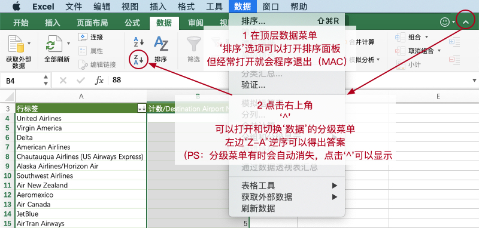