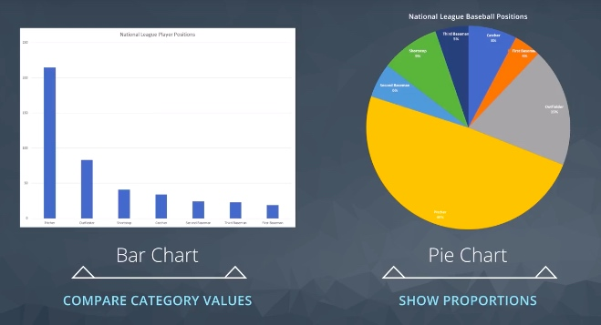
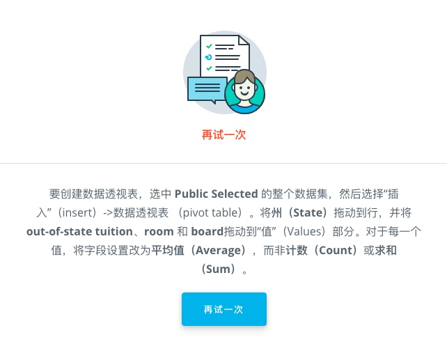

# 04 /描述统计学/ Lesson6 电子表格4:可视化数据

[TOC]

## / 2.饼图

饼图的作用是高速听众每个位置在总体中所占的百分比（而且饼图和我们的日常生活经验十分接近，吃Pizza的感觉有没有），而且在 Excel 中十分方便（见视频）：

1. 选中数据区域
2. 选中图形方式为饼图
3. 等图形生成以后选择图形样式
4. （如果样式不能满足，也可以细微调整，选项很多大家自己探索）

视频1:35处开始的技巧提示：
1. 按住contrl（Mac系统 command）可以选择两个不相邻的行。
2. 在目标位置control-v（Mac系统 command-v）则会粘贴在一起，非常方便。
3. 粘贴之后，在粘贴的位置会出现一个小的“剪切板”，点击可以有丰富的选项（比如将粘贴的两行转为两列的转置功能）。

## / 3.练习：饼图

这里的的 Checklist 第三项：在”数据透视表“页面上，将 GICS Sector 字段设为行，**每行为股票数。**是说把“Ticket Symbol“设定为值的意思（拖动到值那里就可以了）。

如果使用的是 Mac Office 2016 的话，插入图表要在顶层菜单“插入”-“图表”-“饼图”生成。生成后通过“图表设计”选择样式。注意“快速布局”无法打开，如果想要修改，可以把文件传到微云上，在网页（Office365）操作相关内容。如果为了得出答案那就不必了。

## / 4.柱形图

相比饼图显示比例，条形图可以更好的显示不同类别的值是多少：

## / 5.散点图和折线图

如果我们拥有和时间相关的数据集，可以使用折线图来展示，可以看出数据随着时间变化的趋势（比如股票价格）。

Tips：
- 如果选中了多列数据，则会得到多条颜色不同的线
- 可以通过调整图形显示的起始y坐标来让图形更加容易观察（见下图左右对比）：

散点图则是把两个不同类别的数值作为一个点的x值和y值画到坐标系中。当当大量的点画到坐标系之后，我们就可以看到这些点的趋势，也就可以判断出作为x值和y值的两类数据之间的关系了（详细见第7节练习）。

## / 6.练习：图表类型

Tips：
- 柱形图和直方图比较相近。柱形图显示的是实际数量，而直方图则是显示将数据划分成一个一个连续范围后出现的次数之和。（比如说年龄0-10岁，11-20岁，21-30岁这样3个区分）
- 箱线图是新的概念，大家可以试着自己搜索。第一四分卫的意思是说：当把数据从小到大排列后，排在25%处的数据是多大，其他的以此类推。

## / 7.练习：散点图

这节对散点图这种适用于双变量数值数据的图形进行扩展。双变量就是说想身高和体重这两个数值的变量，我们把每个数据按照x，y的值画出来就是这样的：

这里大家是不是注意到了图形中的那条虚线，这个是“趋势线”表示了数据的走向。当x增加的时候，y也会增加（身高增加了，体重也比较可能增加）。这个虚线的趋势就是“相关性”。

需要注意，相关性是有正负的，上面身高的例子是正相关。下面这个河流速度的例子则是负相关（河水越深，流动速度越慢）：

Mac完成指导：

但是做上角的两个画叉的部分点击没有反应（都是最新版），但是做到上图3的位置已经可以完成练习了。如果需要加标签和调整细节，需要把文件上传到“微云”中打开编辑（嵌套的简版Office365）：

PS：添加“趋势线”的操作：`设计（Design）->添加图表元素（Add Chart Element）->趋势线（Trendline）->线性（Linear）`只能在 Windows 下完成，不添加不影响完成练习。

第二个练习中，由于 Excel 表的前几行是文字，全部选中的话会出现奇怪的图形。就需要把真正的数据圈上再点击作图了。

## / 8.9.图表布局

这两节如果是 Mac 的在以后操作中请到“微云”完成。

## / 10.直方图

这里大家一定要弄明白直方图（Histogram）和柱状图（Bar）的关系：直方图是一种柱状图，很亮的是数据在数据集中出现的频率。（A column chart that measures the frequency of data in a data set.)

那么这个频率用什么来定义呢？这个单位就是“箱”bin，就是出现频率范围的宽度。（这个宽度是可以自己定义的，比如年龄按照5年分隔，还是10年分隔）

下图是条形图（左侧，按照位置队员的数量）vs 直方图（右侧，按照 1M 薪资为区分的人的数量。注意这里的间隔就是 bin，也可以设定为 2M 等等）：

在 Mac 上由于 Bug，需要在 “微云” 上完成，如下图（有些细节比如 bin 的调整还是不可以，但是已经可以制作出直方图了）：

这一节出现了如何打开“分析工具库”功能：[分析工具库](https://support.office.com/zh-cn/article/%E5%8A%A0%E8%BD%BD%E5%88%86%E6%9E%90%E5%B7%A5%E5%85%B7%E5%BA%93%EF%BC%8C%E5%9C%A8-excel-%E4%B8%AD-6a63e598-cd6d-42e3-9317-6b40ba1a66b4?ui=zh-CN&rs=zh-CN&ad=CN)，在后续项目中需要使用。

## / 12.箱线图

箱线图（Box Plot）是使用5数概括法来对数据的离散程度进行衡量。那么事么事数据的离散程度呢？离散程度衡量的是数据集中的每个数据点之间的差异。

如果我们把数据按照从小到大的顺序，从左到右排列，那么我们可以得到以下5个值：
- 最小值：最左边的那个
- 最大值：最右边的那个
- 中位数值（第二四分位值）：中间的那个（排序50%大小的那个值）
- 第一四分卫值：排序25%大小的那个值
- 第三四分卫值：排序75%大小的那个值

有了这5个值，我们就可以用箱线图来展示了数据的分布情况了，一图胜千言么（Excel还会多提供一个值，平均值，标示在箱线图的中间）：

## / 14.专业展示

这一节对于展示数据的几点提示非常中肯，当你制作完一个图标的时候，需要根据你使用的场景进行调整优化，以便更加清晰的传达你想要别人理解的信息：

**展示数据前要弄清的问题：**
- 展现的目标是什么？What questions are we answering?
- 展现的方式是什么？What patterns are we trying to show?
- 谁是听众？Who is the audience?
- 展示整体信息还是详细信息？Overview or in-depth?

## / 15.练习：专业演示

Tips：在筛选的时候可以把条件定位为“开头是”，比如这个例子可以选出所有是 Illi 开头的学校：

在做筛选的时候，还有一点需要注意，这个数据文件的表头在第二行，所以在筛选时最好删除第一行，否则筛选只会在A列进行，而且在做数据透视表时也会出现问题：

Tips:Udacity的课程测试是非常走心的，即使是报错也会给出指导（比如这个我忘记把count换成sum的反馈）：

至于第三题，我把生成好的数据除了“数据透视表/Pivot”这页都删除以后放到“微云”上，大部分的功能可以完成（文件不能大于5M，个性化的文字格式和图标背景等无法使用）：

Tips：
大家请注意，题目的图是要求先排序再画图的，排序好的文件我会上传到微云：`american-colleges_web.xlsx` 请大家在自己的微云上完成探索。

## / Plus.如何选择图表的类型

感谢Kylie大大给的这张图，特别帅！另外，在Tableau那一课也会探讨图表类型的问题。

## / Plus.可视化课外阅读

这篇[/数据可视化入门（pdf）/](media/15446997767343/Data_Viz_Note_cn.pdf)非常简洁的介绍了可视化的几个重点问题，推荐阅读。