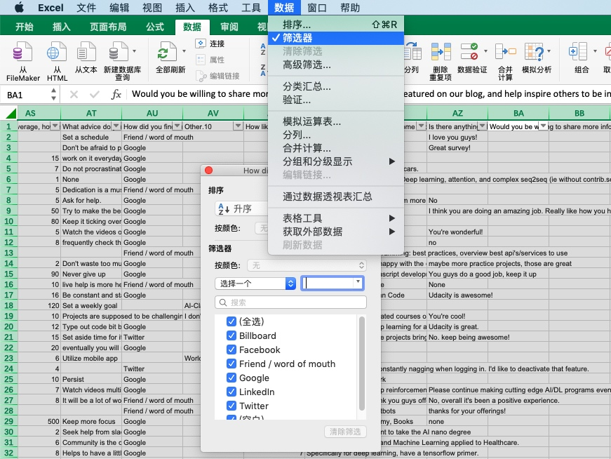
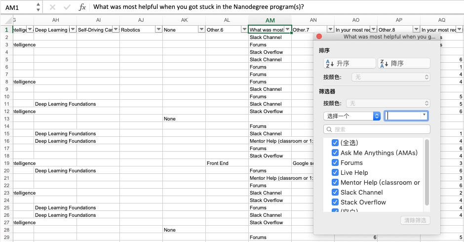
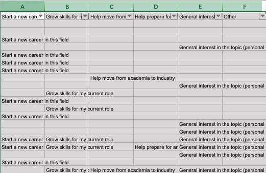
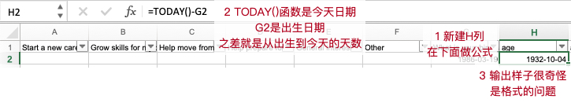
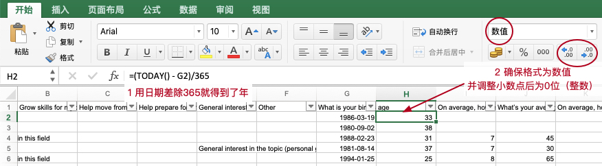
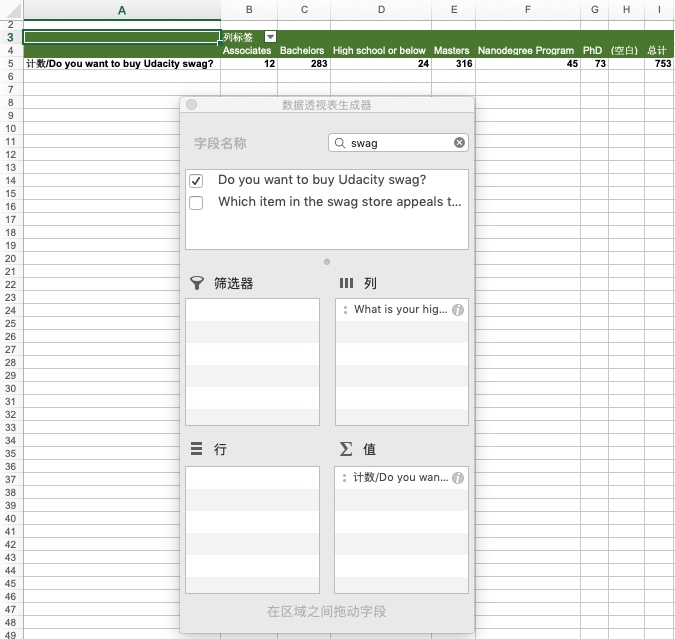
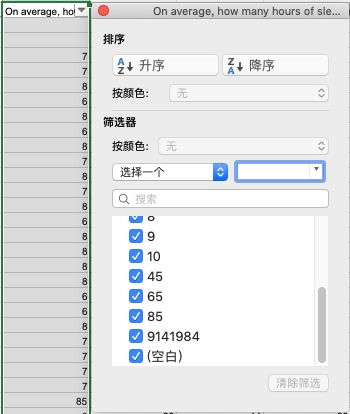

# 05 /描述统计学/ Project 分析问卷数据

[TOC]

## / 1.项目概述

本项目是对Udacity的调查问卷进行分析，涉及到两个文件：
1. surveydata.xlsl 这个是调研问卷，数据处理和作图在这里。
2. survey-project-submission-template.pptx 这个是提交报告的文件，需要提供4页，每一页都有一张图和相关说明。

拿到一个数据，第一步是对数据进行观察，可以选中所有列，并开启筛选，这样在点击每一列上面的小箭头的时候，可以看到这列的值都有什么。整体数据有700多行（选中一列，底下的计数就是值的数量）：

有的时候数据会有数据字典，解释每个数据列的作用。这个数据没有，那么我们怎么办呢，我给个建议：使劲看！开玩笑了，其实拿到数据进行浏览，理解数据的feature都是啥非常重要，而一般来讲，第一行的表头是这列的说明：

比如说像上面AM列的例子，表头是 `What was most helpful when you got stuck in the Nanodegree programs(s)` 问的是当卡住时，最能帮助你的是什么。可以推断出，表头的信息就是调研问卷中的内容了，比如论坛啊、导师帮助啊（弹出的列表框）。

另外，在我开始看的时候， 像 A-F 这几列确实开始摸不着头脑：

列明和内容完全一样，而且有6列，后来观察发现了这6列，每1行有的选的多，有的选的少，👎没有规律，然后呢傻了一会就恍然大悟了：
- 这6行是回答的一个领域的问题：在Udacity学习的目的是什么。
- 应该是有6个多选框，每个框对应一个目的，比如第1列对应：Start a new career in this field；第2列对应：Grow skills for my current role.
- 大部分还是选额了1-2个。

**强烈要求对每一列都认真观看，能够理解调查问卷的数据结构，才能对后续分析胸有成竹（都不太清楚有啥数据，还怎么分析？）**

这里提示要做一列显示年龄，提示如下：

如上图，输出的很奇怪，这是因为默认按照时间格式处理的，而且单位是天，需要转换下：

## / 2.探索数据 I

这部分就开始探索数据了，那么在Excel中，我们怎么探索呢？（我才不会提示你，把所有数据扔进“数据透视表”，这么强大的工具用起来啊！）

注意，在数据透视表中，是可以搜索的，比如习题 1/4 里的第一问：最常见的 “High Degree Earnd（取得的最高学位），我就直接搜索就行了（有50多列数据，一个一个浏览会瞎的）：

这额数据有一点问题：没有编号列，所以刚一看不知到明确的行数。这样在做各种统计的时数据会又些出入。解决方式是：
1. 建立统一的id。表格总共为754行。可以在几个比较全的列使用 command + 下箭头 达到最底行。之后再观察得出。
2. 找一列有全部数据的列，比如 `Do you want to buy Udacity swag？` 这一列。

### // 习题 1/4 

**第1小问：**
接着上个 swag 的情况，那么就可以这样计算第1小问：
- 把 “Highest Degree Earned” 放在 ”列“
- 把 ”Do you want to buy Udacity sway“ 放在 ”值“
- 因为值默认是 count 数个数，所以这里就能得出各个学位的数量了
- （PS：其中 Associates 是大学肄业）

**第2小问：**
第2小问直接使用 = AVERAGE() 平均值函数就可以了，不过求出来的答案让人费解，回到数据里，抓获几个异常值（最后这个9141984是几个意思！）：

使用做到后来才发现，这里的要求是：**在检查数据之前，你认为可能对的是！！！**是靠直觉和理解选择，不是去计算（优达菌不要这么淘气好不好～）。PS，这里其实没有正确答案，但是如果你想看到：

那我偷偷告诉你，答案是这样的：

### // 习题 4/4

这里提示下使用 COUNTA 数非空元素，还要注意每个课程是一列，所以要每一列都用一个公式数一下，位置在 AD 到 AM 列。

## / 2.探索数据 II

这里可以在 数据探索I 的基础上继续完成，使用 Pivot 和 Fuction 就可以。

## / 3.数据探索 III

这一节不用做图，但是要根据所提供的展示图作答，需要以下几个内容：
- 理解直方图是什么
- 理解右偏态图形形状
- 理解异常值对数据分析带来的影响（对比最后睡眠的两个图）
- Tip：之前 sleep 数据都在（X轴）) 0.0 和 0.1 之间，之所以是这样，是因为为了能够把那个异常值放进来，X轴的坐标单位是 $1e^7$ 就是10的7次方。

## / 5.项目详情

到这里大家就可以按照自己的理解完成项目了，请注意阅读项目的要求。加油！Excel的项目多尝试非常重要，虽然不用写代码，但是对一些操作的理解还是试过才会记得。
PS：MAC可以完成这个项目的，注意存盘和本板块导学里的一些说明。