# 06 /用数据解决商业问题/ Lesson3 线性回归
> 课程链接：[**/用数据解决商业问题/** Lesson3 线性回归](https://classroom.udacity.com/nanodegrees/nd002-cn-svip/parts/040afa6c-3c5d-4b44-bdd0-b420a0455145/modules/51c76090-9346-4506-8f01-bfae811dcc94/lessons/316c6f13-a660-456e-86a6-bbae79f8c577/concepts/dc105e00-66a9-4cc3-af26-d5ff2fcfd813)

[TOC]

## / 4.数据理解解决方案

这就是要按照方法图进行选择，套路一下：

**第 1 步：这是一个数据丰富还是数据不足的问题？**
> 我们来回忆一下数据丰富与数据不足之间的差别。如果我们拥有关于所要预测的变量的以往数据，则是数据丰富，否则是数据不足。 要确定我们是数据丰富还是不足，需要对数据有更好地理解。看看我们的数据集，可以看到我们有每位客户的以下信息：
- 每位客户每周提交的平均工单数
- 每位客户的员工数
- 与每位客户的合同价值
- 每位客户所处的行业
- 由于我们有每位客户的工单数，所以说我们是数据丰富的。

**第 2 步：我们应该使用数值型还是分类模型？**
> 我们尝试预测的目标结果是一个数字，代表每位客户预期的平均工单数，因此我们应该使用数值型模型。

**第 3 步：我们的目标变量是连续型还是基于时间型？**
> 我们要获得的是每周的平均工单数。因此乍一看，我们可能会认为这是一个基于时间的问题，如果我们希望预测几周时间内每个日历周的特定数量，则确实是这样。但是在这个问题中，我们只想要每周的平均数，对特定的日历周不感兴趣。因此，我们将使用连续型模型来解决我们的问题。

## / 6.线性回归简介

这一节咱们先看下面的图了解什么是**斜截式 (y = mx + b)**：

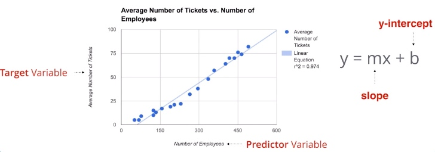

图中的四个红色标注，下边的 Predicter Variable 对应的是 x 的值，为预测变量（自变量）；左侧的 Target Variable 对应的是y，为目标变量（因变量）。

图中的蓝点是我们收集到的数据，每个蓝点都是由（x,y)组成的，对英因变量和自变量，给出x，就有一个y值和它对应。

那么根据这些蓝点我们就可以画出一条回归线，就是图像中那条蓝色x线（画的原理后面会讲）。这样我们有了 y = mx + b 这条线了。当我们有了一个x，就能得出一个y。就做到了从x预测y。

公式中的b为截距（图中标记的 slope），m为y轴斜率（图中标记的 y-intercept），此部分课程下拉的说明比较详细，可以参考。

## / 7.Google 表格中的线性方程

Excel的斜率和截距方程与Google一样，Mac Office2016测试完美。`SLOPE()` `INTERCEPT()`。

PS：这里下载的文件比视频中的文件数据更多，所以生成的答案有些不同。

## / 8.线性回归验证

根据上一节，我们计算出了 y = mx + b 这条线，那么我们算出的这条线是不是能够很好的表达出来 x 和 y 的关系呢？这就需要用数据去测试了。那么我们怎么来测试呢？可以使用相关系数r，这个值的计算方式后续会讲解，但是 r 是一个 -1 到 1 的值，而在做数据处理的时候负数不好处理，所以我们把 r 做平方生成 $r^2$ ，这个就是决定系数：

- 第 1 步：相关性（**相关系数**）：
    - 使用相关函数 CORREL(data_y, data_x)，我们可以计算目标变量和预测变量之间的相关性。该值通常称为 r。r 的范围为 -1 到 +1。r 越接近 +1 或 -1，x 和 y 之间的相关性越高。在我们的例子中，r 的值为 0.987，表示强相关。
    - Excel使用函数 `CORREL()` 计算r。
- 第 2 步：计算 R 平方（**决定系数**）：
    - 决定系数的定义：Coefficient of determination: Percent Variance in observations explained by the mode.虽然强相关很好，但我们真正想知道的是，数据在直线上的拟合表现如何。好在，我们可以通过计算决定系数（coefficient of determination）或 R 平方（记为 R² 或 r²），来了解此公式在逼近数据方面的表现有多好。R 平方是取值在 0 和 1 之间的一个系数。R 平方可以解读为，模型解释的观察值变差的百分比，或模型的解释力。R 平方接近 1 意味着模型解释了目标变量的几乎所有变差。R 平方接近 0 意味着模型几乎未解释目标变量的任何变差。（注：目标变量 y 的取值波动称为“变差”）
    - 解读 R 平方的注意事项：你如何解读 R 平方在很大程度上取决于你要建模的问题和你使用的数据。对于棘手的问题，R 平方很低可能是可以接受的。而且，较高的 R 平方也有可能由于模型不佳导致的。但是一般来说，R 平方越高越好，特别是当你添加和删除预测变量来决定最强的预测模型时。要了解有关解读 R 平方的更多信息。
    - Excel使用函数 `RSQ()` 计算r。
    - 从数值上看，0.7 是great，0.5是good，0.3以下是bad。
    - 附加资源：
        - [/相关性/](https://www.mathsisfun.com/data/correlation.html)
        - [/R 平方/](http://blog.minitab.com/blog/adventures-in-statistics/regression-analysis-how-do-i-interpret-r-squared-and-assess-the-goodness-of-fit)
        - [/R平方的解释（en）/](http://blog.minitab.com/blog/adventures-in-statistics/regression-analysis-how-do-i-interpret-r-squared-and-assess-the-goodness-of-fit)

最后，算出的值和图形题、对应就是这样的了：
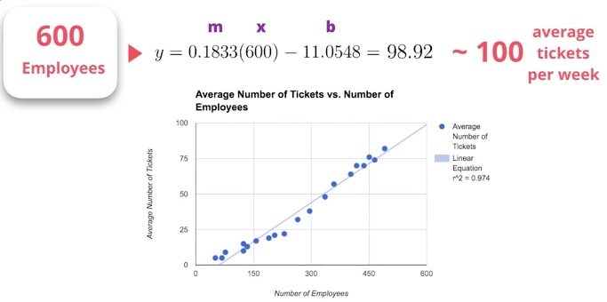    

### // （Plus）如何解释R平方
上面最后文章其实是讨论如何看待R平方的结果，以及R平方结果和适配是否够好的关系，摘抄3点如下：

- **Graphical Representation of R-squared：**The regression model on the left accounts for 38.0% of the variance while the one on the right accounts for 87.4%. The more variance that is accounted for by the regression model the closer the data points will fall to the fitted regression line. Theoretically, if a model could explain 100% of the variance, the fitted values would always equal the observed values and, therefore, all the data points would fall on the fitted regression line.
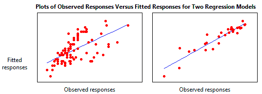

- **Key Limitations of R-squared：**R-squared cannot determine whether the coefficient estimates and predictions are biased, which is why you must assess the residual plots.R-squared does not indicate whether a regression model is adequate. You can have a low R-squared value for a good model, or a high R-squared value for a model that does not fit the data!

- **Closing Thoughts on R-squared：**R-squared is a handy, seemingly intuitive measure of how well your linear model fits a set of observations. However, as we saw, R-squared doesn’t tell us the entire story. You should evaluate R-squared values in conjunction with residual plots, other model statistics, and subject area knowledge in order to round out the picture (pardon the pun).

## / 9.练习：简单线性回归

这里大家就可以自己计算一下了（这里的文件在s3存储，不好下载，可以在微云分享中找到）。PS：下一节是详细的解决办法，卡住了可以参考。

## / 12.多元线性回归概念

当我们有多个参数（因变量x）的时候，就可以将线性回归扩展为多元线性回归了：

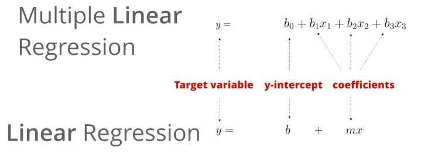

比如这个例子：
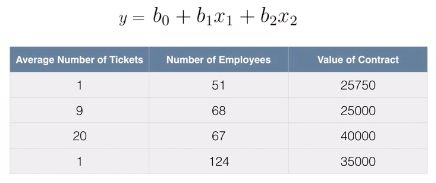

## / 13.Excel的多元线性回归

在前面的初始准备部分，有一个小小的课程扩展，讲述了数据清理的入门概念，课程内容不错，进度Ok的同学可以参考，数据清理的内容后续也是有专门项目的：[/创建分析数据集/](https://classroom.udacity.com/courses/ud977/lessons/62614c2d-0e8c-45e6-a225-cdc34495e911/concepts/d200ff73-f9fa-4a16-b09b-4f1d1671984f)

PS：
- Mac Excel 做出散点图之后不能添加那根回归线。
- 这张图是在前面301行那个同名文件中做出来的。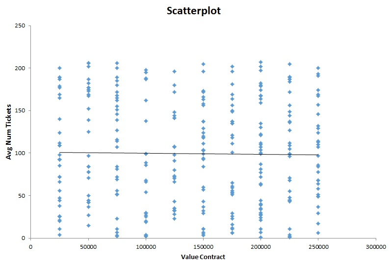
- Mac Excel 的分析工具库在这里打开（点开后画勾确认）：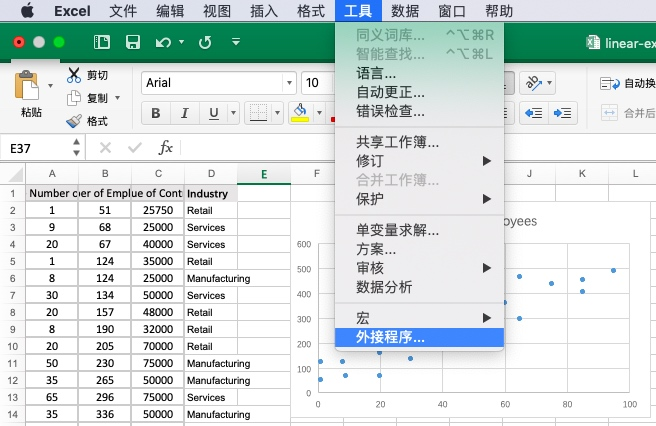
- 打开后，在数据的最右边有了新的选项‘数据分析’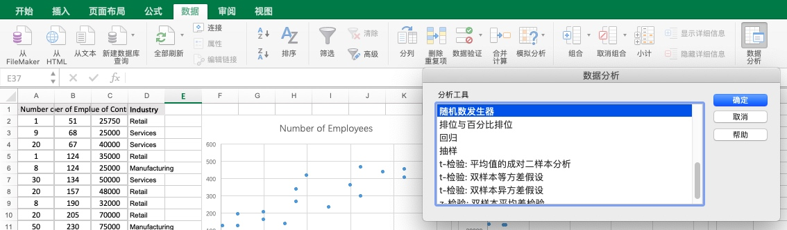
- 结果会默认放在一个新的页面中，大概是这样的（内容后续会解释）：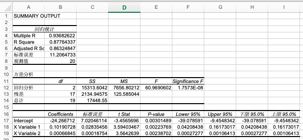

于是我们就能从左下角 coefficent 这里得到多元线性回归的3个系数（这个只是系数，不是相关系数），所以这里回归出来的线性返程就是：`Y = -24.2667 + 0.1019 X1 + 0.00067 X2` 其中X1是员工数量，X2是合同价值。

最后再对结果最上面的输出做个讨论：
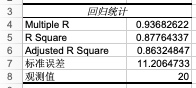
- 第4行就是根据多元线性回归计算出的R
- 第5行是4的平方
- 第6行诗对5的修正，因为统计学家发现，多元线性使用的X越多（比如这个例子中我们使用了X1和X2），就越能提高决定系数R Square的值，让他接近1。这种情况是由于其实X之间也可能有相关关系，所以在计算多元线性回归的时候，对5的结果做调整，得出了这里的6。
- 第7行则是STD标准差，是结合了所有X（这里是X1和X2）和Y计算出的标准差（公式比之前的要复杂些，后面会扩展）。
- 第8行是说一共通过了20个数据进行的计算。

## / 15.线性回归与分类变量

那么我们发现了当添加新的变量的时候，决定系数（R Squred）会上升，那么如果我找到了一个分类数据，怎么能加入到这个回归模型中，让它变得更加准确呢？

> 现在将类别的实际值放入方差中将不起作用，因为你不能使用字符串变量来做数学运算，因此我们必须以某种方式转换变量。没有经验的分析师可以会简单地为每个类别分配一个数字并将其插入模型中。

所以我们需要将分类变量进行转换：将分类变量转换成虚拟变量，这里举个后面会遇到的例子：

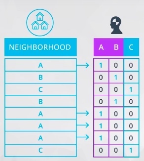
- 上图左边是分类数据，这一列“Neighborhood”把邻居（这是个房地产数据）划分为3类。A，B，C。
- 为了能进行回归的计算，我们把它转化成右侧的虚拟变量，变为A，B，C三列。
- 如果左边是A，右边A这列为1，其他为0。以此类推。
- 还要注意的是右侧A，B，C三列，知道任意两列，就可以推导出第三列的值（三个值中有且只有一个值为1）。
- 所以课程中会说：

> 虚拟变量只能取两个值，一般是 0 或 1。你可以添加比分类变量中唯一值数量少一个的虚拟变量数。所以，如果变量是二元的，则添加一个虚拟变量。如果有四个类别，则添加三个虚拟变量，课程中的例子：

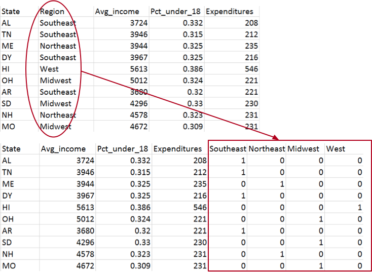

PS：
- 上述变换在 Excel 中使用 if 得出。
- 习题1/2的答案为“是”，意思就是说当我们将分类变量变为虚拟变量以后，就要进行计算了（计算方式见下节练习）。

## / 16.虚拟变量练习

此部分的前面描述特别形象的解释了虚拟变量在多元线性回归中的计算方式和解释，属于敲黑板级别的，要看懂！后面的练习偷懒的话就在excel中写公式算吧。（计算器？，，，少年你好勤奋，，，，）

$学校开支 = -468 + (0.067 x 平均收入) + (1349 x 18 岁以下人口百分比) -14.4(if type: 中西部) - 9.3(if type: 东南部) + 16.5(if type: 西部)$

假如说有一个州的平均收入为 4011 美元，18 岁以下的人口百分比为 32.5%，位于东北部区域。计算步骤如下:

$学校开支 = -468 + (0.067 x 平均收入) + (1349 x 18 岁以下人口百分比) - (14.4 x 中西部) - (9.3 x 东南部) + (16.5 x 西部)$
$学校开支 = -468 + (0.067 x 4011) + (1349 x 0.325) - (14.4 x 0) - (9.3 x 0) + (16.5 x 0)$
$学校开支 = -468 + 268.737 + 438.425 - 0 - 0 + 0$
$学校开支 = 239.162$

## / 17.解释线性回归结果

看3遍！看3遍！看3遍！要点摘要如下，这里面每一个都要看懂，成就感有没有，专业感来不来：

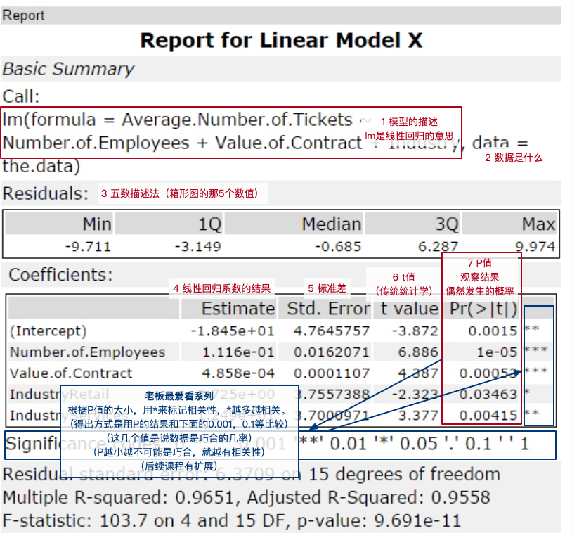

- P 值（P Value）：The p 值是观察结果（系数估计值）偶然发生的概率，并且预测变量与目标变量之间没有实际关系。换句话说，p 值是系数为零的概率。p 值越低，预测变量和目标变量之间存在关系的概率就越高。当 p 值较高时，则不应该依赖于系数估计。当预测变量的 p 值低于 0.05 时，其与目标变量之间的关系被认为具有统计学意义。
- 统计显著性（Statistical Significance）：“统计显著性是一种不可能随机发生的结果，而是很可能归因于某个具体原因。” —— 投资百科。除 p 值外，右边的星也表示具有统计显著性。星 (*) 越多表示显著性越高。在我们的例子中，我们看到预测变量是显著的，其中员工人数和合同价值是最显著的。通常，我们要从模型中删除不能统计显著地预测目标变量的变量。
- R 平方：在我们的例子中，R 平方为 0.9651，调整的 R 平方为 0.9558。因此，我们通过增加类别改进了模型。在现实问题中，我们可能会使用不同的预测变量运行模型，或者看看我们是否有额外的信息添加到模型。记住，R 平方的取值范围为 0 到 1，表示由预测变量变化解释的目标变量的变化量。R 平方越高，模型的解释力就越高。
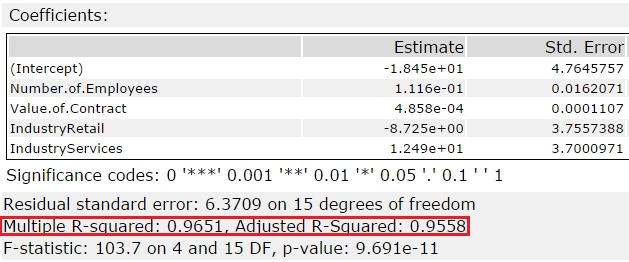

## / 18.评估方程

总算到动手的时候了，“捋起袖子加油干，一张蓝图绘到底！”（，，，跑错片场了，，，）。制作虚拟变量列提示如下：

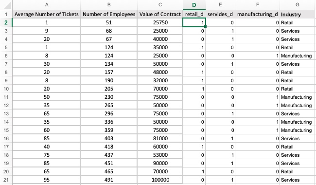

- 注意即使做完了虚拟变量列后，G列也不能删除，因为后面是根据它算出来的，当然copy之后数值之后就没关系了。
- 注意公式中那些是绝对地址，方便复制。
- 在图中那个绿色选项框的右下角的绿色实心小方块处双击，可以快速填充整列。
- 注意因为Excel要求输入变量需要连续，所以DEF加在了G之前。

结果输出是这个样子滴，最后一行是个什么鬼，大家知道为什么吗？
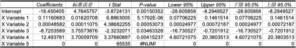

原来在回归时候，我把三列虚拟变量都加进来了，应该去掉一个变量就对了（可见答案还是一样滴）：
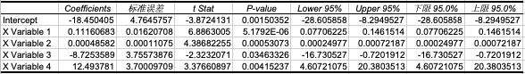

剩下的计算在下一节答案中有详细解答，加油！

