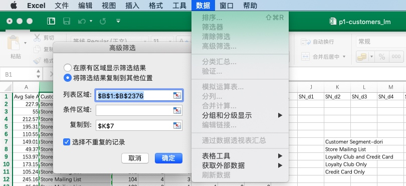
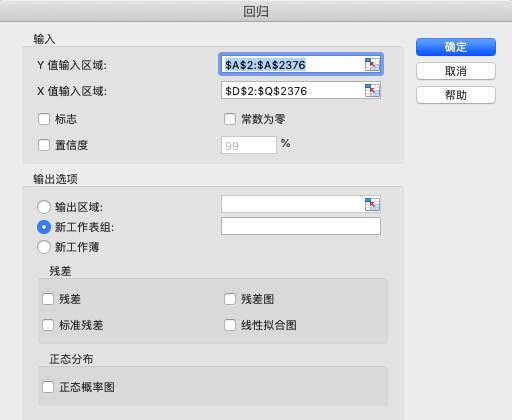
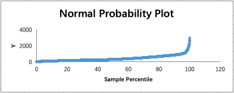

# 07 /用数据解决商业问题/ Project 预测商业决策带来的收益增长

> 课程链接：[**/用数据解决商业问题/** Project（进阶）预测商业决策带来的收益增长](https://classroom.udacity.com/nanodegrees/nd002-cn-svip/parts/040afa6c-3c5d-4b44-bdd0-b420a0455145/modules/645d58b0-0428-4f37-84b7-d23ab925e533/lessons/69611016-0e23-4c4d-a68b-c64329f24240/concepts/96c8d7b1-9725-4870-8498-243a89fdcbd3)

[TOC]

## / 2.项目详情

在进行一个项目的时候，详细阅读项目的相关介绍非常重要。Udacity在任何一个项目中都会引入相关的场景，对于每一个项目场景的理解不但能够加深对项目数据中内容的了解，更能对相应场景有较深刻的认识，方便带入到真实工作中，摘录如下：

### 业务问题

> 公司今年的邮寄名单中新增了 250 名客户，他们希望向这 250 个客户寄送产品目录册。你的经理请你计算下通过向这些客户寄送产品目录册公司预期盈利多少。如果这些新客户带来的预期利润超过一万美元，那么管理层就会向他们寄送产品目录册。

这其实是一个简化了的决策问题，250名客户，利润大于1万美元，就给他们邮寄产品目录。这种数值预测使用线性回归模型可以解决。

### 详细信息

> - 印刷和寄送每本产品目录册的成本是 6.5 美元。
- 通过产品目录册出售的所有产品的平均毛利率（价格减去成本）是 50%。
- 在计算利润时，确保先将收入乘以毛利率，然后再减去 6.5 美元的成本。

可以看出来，数据已经被简化了，不用着急，后续会越来越接近真实场景，一步一步成为小达人近在眼前。

### 成功完成项目的步骤

每个项目中，还会对项目的步骤做出规范，将一个庞大的任务拆解成一个一个小目标，并提供一个模版。请按照步骤和模板要求一步一步完成。模版中会对一些小节做非常详细的描述和说明，仔细阅读非常有帮助。本项目的回答流程是（套路）：

- 第 1 步：理解业务和数据
    - 你的项目应该包括：对需要作出的关键业务决策的描述**注意：**我们已经为此项目提供了整洁的数据，因此可以跳过问题解决框架中的数据准备步骤。
- 第 2 步：分析、建模和验证
    - 构建一个线性回归模型，然后使用该模型预测这 250 个客户带来的预测销量。我们建议你使用 Excel 处理数据。**注意：**如果你决定将 Customer Segment 当做你的一个预测器变量，请将基础条件设为 Credit Card Only。但是，你可以随意使用你喜欢的工具。你应该创建线性回归模型，并得出线性回归方程。**（这里指的是在建立的虚拟变量中，不将Credit Card Only加入线性分析，所以是基础变量。这样便于答案的统一）**
    - 在构建线性回归模型的过程中，你可能会发现数据中用到了分类变量。如果你不知道该如何进行处理，可以回顾一下“线性回归”课程中的“线性回归与分类变量”、“虚拟变量练习”等小节。
    - 得出线性回归方程后，应该使用该方程预测邮寄名单中的每个人预计带来的销量。
- 第 3 步：撰写报告
    - 得出预测或预期利润后，撰写一个简短的报告，并建议公司是否应该寄送产品目录册。**提示：**我们希望计算这 250 个客户带来的预期收入，以便计算预期利润。意味着我们还需要乘以客户购买宣传册中产品的概率。例如，如果客户要购买我们的产品，我们预计该客户将购买价值 450 美元的产品。此人有 30% 的概率将实际地购买我们的产品，因此预计收入为 450 美元 x 30% = 135 美元。

## / 4.项目验证

> 使用 Score 工具向新数据集应用回归公式后，当你将预测的销量（Score）乘以购买概率（Score_Yes）后，第一条数据记录的值是多少？这是第一条未对数据进行任何排序操作的记录，应该为“A Giametti”

练习题解题思路：
- 请注意上节做后部分。也就是说，我们的目的是预测购买的金额是多少，而购买意愿的百分比已经做出来了，用Mailing List的Score_Yes和Score_No来表示。
- 从逻辑上，购买意愿肯定不是100%，而这个值的得出应该从以下数据中计算得出：注册了也购买了的客户 vs 注册了但没购买的客户。
- 这次项目并没有提供注册了但没购买客户的数据，所以直接用Score_Yes的结果就好了。
- 在做虚拟变量的时候，可以使用“高级筛选”，选中“选择不重复的记录”再指定输出区域（下图右下角）来得到所有值的列表。

Tips：对于Excel回归面板中的默认选项不用调整，说明如下：

- 标志：在输出结果中会用x变量的最常见数值作为名称，而不是“X Variable 1”这样表示。
- 常数为零：在Intercept截距这里，用“0”替代“1”。
- 置信度：在输出结果的最右边会输出置信度的区间，默认是95%。可以手动指定。
- 残差：定义残差相关的输出。
- 正态概率图：会在结果输出一个正态概率图（会做出每个数据的对应点，数据大慎重点击，风火轮了解一下），标记了从0到100%数据排序值的情况，如下图：

## / 5.项目提交

注意将你的template报告存为PDF并提交：
- 建议将文件名加上自己的名字和版本号
- Office2016在另存为tab中，选择格式为PDF即可导出PDF文件
- 文件名不要有中文，提交时打包成zip文件